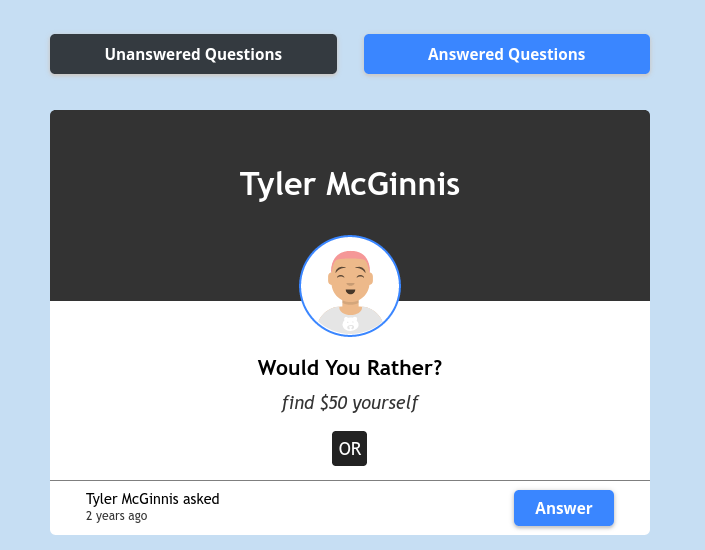

# Would You Rather? (Udacity ND)

## Run It On Your Machine

- install all project dependencies with `npm install`
- start the development server with `npm start`

## About The App

This is my implementation of the Would You Rather?, it's the second project for the Udacity's React course, part of the React Nanodegree Program. Would You Rather is a polling game that presents the user with a series of questions that can be answered one of two ways. It's built with React, Redux, React Router.

**Live Demo** [https://csb-8rwe3.netlify.app/]

## Technologies

### Client Side

- HTML, CSS
- ES6 (modules, promises, async/await ...)
- React
- Redux
- React Router
- Styled Component

## Backend Server

The \_DATA.js file represents a fake database and methods that let you access the data. The only thing you need to edit in the \_DATA.js file is the value of avatarURL. Each user should have an avatar, so you’ll need to add the path to each user’s avatar.
